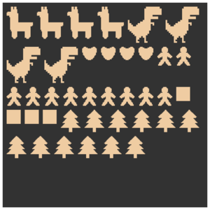
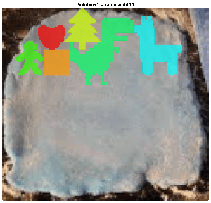
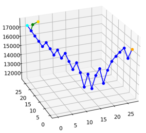

# Biscuit Optimizer

This repository contains the project for the optimization course at Politecnico di Milano - A.Y. 2021/2022. It consists 
in different solutions of the problem of choosing how to cut some biscuit dough given the set of available cutters. 
This problem is known in the literature as nesting problem.

## The problem
The problem takes as input an image of the dough mask and a set of cutters as binary masks.

All files in the cutter folder are treated as cutter masks and are expected to be in the format 
<cutter_name>.<cutter_value>.png

## Technologies
This project was developed using the following technologies:
- AMPL with CPLEX
- Python with Google OR-Tools and CP-SAT solver
- Python with Gurobi's API and solver
- Pure Python 

## Solutions

### Integer knapsack models
The first approach to the problem is a relaxation that doesn't take into account the position or the overlapping of 
biscuits; it results in an integer knapsack problem, which is an upper bound for the complete problem. This model was 
solved with AMPL (CPLEX), Google OR-Tools (CP-SAT) and Gurobi.

### Nesting models
The complete problem was approached through modeling techniques in AMPL (CPLEX), Google OR-Tools (CP-SAT) and Gurobi. 
However, due to the NP-hard nature of the problem, these models were
limited at 40000 seconds (some minutes less than 12 hours). They found locally optimal solutions.

### Heuristics
In order to reduce the run time, greedy heuristics were devised to tackle the problem. They were faster unable to
reach the top models' results.

### GRASP
The final approach to the problem was an implementation of GRASP as per the References' papers.
These heuristics with Path Relinking were able to reach higher values with respect to full models.

## Extra: image augmentation applications
In order to show the generality of the solution, the nesting problem was applied to the augmentation of histological 
images.

## Results
The following table summarizes the best results for each strategy:
| Problem          | Technology             | Best value | Run time (s) |
| ---------------- | ---------------------- | ---------- | ------------ |
| Integer Knapsack | AMPL (CPLEX)           | 29000      | 0.11         |
| Integer Knapsack | OR-Tools (CP-SAT)      | 29000      | 0.562        |
| Integer Knapsack | Gurobi                 | 29000      | 0.2          |
| Nesting          | AMPL (CPLEX)           | 16300      | 40000        |
| Nesting          | OR-Tools (CP-SAT)      | 17800      | 40000        |
| Nesting          | Gurobi                 | 17800      | 40000        |
| Nesting          | Greedy heuristics      | 16900      | 3.45         |
| Nesting          | GRASP                  | 17800      | 317.77       |
| Nesting          | GRASP (Path Relinking) | 18500      | 2765.12      |

## Repo structure
The repo top level folder contains the report and the final presentation. The project is organized in the following
folders.

### img
This folder contains the input images.

### report
This folder contains the final report's source and images.

### src
This is the folder for notebooks and models, divided by the task they were solving.

## References
[1] Resende, Mauricio & Ribeiro, Celso. (2010). Greedy randomized adaptive search procedures: Advances and applications.
Handbook of Metaheuristics. 

[2] Delorme, Xavier & Gandibleux, Xavier & Rodriguez, Joaquin. (2004). GRASP for set packing problems. European Journal
of Operational Research. 153. 564-580. 10.1016/S0377-2217(03)00263-7. 

## Author
Roberto Basla: [@rb-sl](https://github.com/rb-sl)

## License
This project is released under an MIT license.
